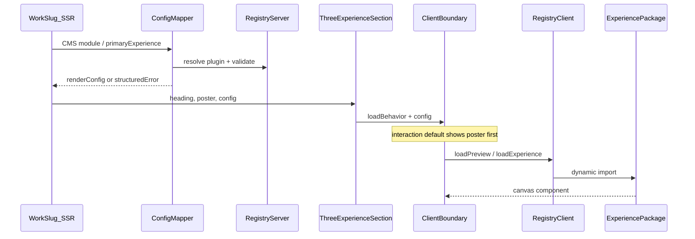

# Architecture — Three.js experience CMS

Phase 0 architecture for a reusable portfolio experience platform on Thrundesigns.com. Controlled Chaos is the first registered experience; the platform must accept any future importable Three.js package that honors the same contract.

---

## 1. Goals

- Author interactive experiences in Sanity without storing executable JS/shaders in the CMS.
- Keep case-study pages server-rendered and useful when WebGL never loads.
- Lazy-load Three.js only after interaction / viewport / explicit immediate policy.
- Support inline preview, fullscreen lab, and saved-creation replay.
- Keep a single registry mapping CMS experience keys → package loaders.

---

## 2. Four layers

```text
Sanity Studio
    ↓
Structured project content (identifiers + approved settings)
    ↓
Next.js project page (GROQ, SEO, mapper, SSR case study)
    ↓
Experience registry (server-safe + client loaders)
    ↓
Imported Three.js package (canvas, interaction, export, replay)
```

### Sanity Studio

Controls: project identity, modules, experience key, preset, embed mode, fallback media, launch actions, featured creation IDs.

Must not: execute shaders, import renderer packages into every form preview, or accept arbitrary package paths / API URLs from editors.

### Next.js server layer

Controls: GROQ, routing, metadata, mapping CMS → embed config, creation lookup, structured errors, SSR of non-WebGL content.

### Experience registry

Controls: key → plugin lookup, manifest/version checks, dynamic imports, launch URL building. **Only** place that maps CMS keys to components.

### Three.js package

Controls: rendering, physics, audio, interaction, export, creation-state replay. Delivered as a separate importable package — never copied into portfolio UI components.

---

## 3. Integration with existing case studies

This repo already uses a page-builder on `project`:

```text
project
  identity fields + cover + seo
  modules[]  →  projectRichText | projectGallery | … | projectThreeExperience
  primaryExperience?   (top-level launch / hero preview config)
  featuredCreations[]  (curated creation ID references only)
```

**Why not `caseStudyBody` Portable Text?**  
The site migrated `body` / `gallery` into dedicated modules. Extending `modules[]` preserves authoring UX, GROQ projections, and [`ProjectModules`](../../src/components/project/project-modules.tsx).

| Spec name | Implementation name |
|-----------|---------------------|
| `portfolioProject` | Existing `project` |
| `threeExperience` PT block | Module `projectThreeExperience` |
| `primaryExperience` | Top-level field on `project` |
| `featuredCreations` | Top-level array of ID + curator metadata |

Top-level `primaryExperience` and an inline module may share an experience key with different modes (e.g. fullscreen launch vs preview).

---

## 4. Registry split (critical bundle boundary)

```text
src/experiences/
  types.ts
  registry.server.ts      # manifests, schemas, presets, URL builders
  registry.client.ts      # dynamic import loaders only
  mapSanityExperienceConfig.ts
  controlled-chaos/       # adapters (persistence, analytics, launch URLs)
```

### Server-safe registry may import

- Manifests
- Zod/schemas
- Preset lists / version metadata
- URL builders

### Server-safe registry must not import

- `three` / R3F / WebGL
- Browser-only React experience components

### Client registry

Defines `loadPreview` / `loadExperience` / `loadReplay` dynamic imports used only from Client Components.

`ExperienceClientBoundary` is the sole mount surface for loaders on case-study pages.

---

## 5. Plugin shape

```ts
export interface PortfolioExperiencePlugin {
  manifest: PortfolioExperienceManifest
  loadPreview: () => Promise<{ default: React.ComponentType<unknown> }>
  loadExperience: () => Promise<{ default: React.ComponentType<unknown> }>
  loadReplay?: () => Promise<{ default: React.ComponentType<unknown> }>
  validateEmbedConfig: (value: unknown) => ExperienceEmbedConfiguration
  buildLaunchUrl: (configuration: ExperienceEmbedConfiguration) => string
}
```

First entry key: `controlled-chaos-poster-lab`.

Future packages register another key in the same maps — no scattered `switch` imports across pages.

---

## 6. Stub → real package path

Controlled Chaos is **not built yet**. Phase 1 introduces a local stub package that implements the public contract:

```text
@thrun-design/controlled-chaos
  ./manifest
  ./schemas
  ./react-preview
  ./react
  ./react-replay
```

- Stub components can be non-WebGL placeholders that accept the same props.
- Studio depends on manifest/schemas only (or a `*-manifest` entry).
- When the real package ships, bump the dependency; run compatibility validation; keep registry keys stable.

Repository model: **separate package** consumed by this app (local path / workspace / published npm). Not a monorepo today; stub may live under `packages/controlled-chaos` with a file: dependency until publish.

---

## 7. Runtime flow (case study)



Fallback order when interactive path fails or is skipped:

1. Interactive renderer  
2. Fallback video (muted, loop, poster)  
3. Poster image  
4. Text + fullscreen launch link  

---

## 8. Routes

| Route | Purpose |
|-------|---------|
| `/work/[slug]` | SSR case study + optional experience module |
| `/lab/controlled-chaos` | Fullscreen editor for Controlled Chaos |
| `/lab/[experienceKey]` | Optional later generic lab router |
| `/creation/[creationId]` | Replay + metadata for a saved creation |
| `POST/GET /api/creations*` | Persistence API |

Lab and creation routes use the **same** package loaders as the embed — no second Three.js implementation.

---

## 9. Persistence and featured creations

Visitor creations are **application data**, not Sanity documents per save.

| Store | Role |
|-------|------|
| Vercel Blob | Immutable creation JSON payload |
| Upstash Redis | Metadata index, rate limits, optional TTL helpers |
| Sanity `featuredCreations` | Curated IDs + display title / note / thumbnail override |

API sketch (Phase 7):

- `POST /api/creations` — validate with package creation schema, size + rate limits, return id  
- `GET /api/creations/[id]` — fetch, validate, migrate if supported  
- `POST /api/creations/[id]/duplicate`  

Sanity never stores full creation JSON.

---

## 10. Versioning and compatibility

Track three versions per experience:

```ts
interface ExperienceVersionReference {
  packageVersion: string
  stateSchemaVersion: number
  embedConfigVersion: number
}
```

Detect and surface (never silently ignore):

- Unknown experience keys  
- Unsupported presets / modes / quality / controls  
- Unsupported state or embed versions  
- Missing package installation  
- Capability mismatches (audio, SVG, export)

Editors see Studio validation warnings; visitors see poster/video fallbacks; developers get structured logs.

---

## 11. Security boundaries

CMS may store: experience keys, preset keys, booleans for approved capabilities, media assets, creation IDs, copy.

CMS must not store: arbitrary JS, shaders, HTML, import paths, API URLs, credentials, raw creation payloads.

Frontend always re-validates with package schemas after GROQ.

Content Security Policy is currently absent; when lab/replay need workers / `blob:` URLs, add narrow directives and document them (Phase 9).

---

## 12. Analytics

Package emits events through a portfolio analytics adapter.

Track: poster viewed, load selected, initialized, failed, fullscreen launch, replay loaded, duplicated, export completed, share copied.

Do not track: user phrase, SVG contents, audio contents, full creation state, gesture coordinates.

Initial adapter: structured console / no-op until a product analytics SDK is chosen.

---

## 13. Proposed Phase 1 structure (preview)

```text
packages/controlled-chaos/          # stub package
  package.json
  src/manifest.ts
  src/schemas.ts
  src/react-preview.tsx
  src/react.tsx
  src/react-replay.tsx

src/experiences/
  types.ts
  registry.server.ts
  registry.client.ts
  compatibility.ts
  mapSanityExperienceConfig.ts

studio/lib/experienceManifestOptions.ts
```

Do not begin Phase 1 until this architecture and the contract review are approved.

---

## 14. Extensibility checklist (new Three.js project)

1. Publish package with manifest + schemas + preview/experience/replay entries.  
2. Register one plugin in server + client registries.  
3. Manifest-driven Studio options pick up the new key/presets.  
4. Editors place `projectThreeExperience` or set `primaryExperience`.  
5. Add lab route segment if fullscreen is required.  
6. Run compatibility script before deploy.
